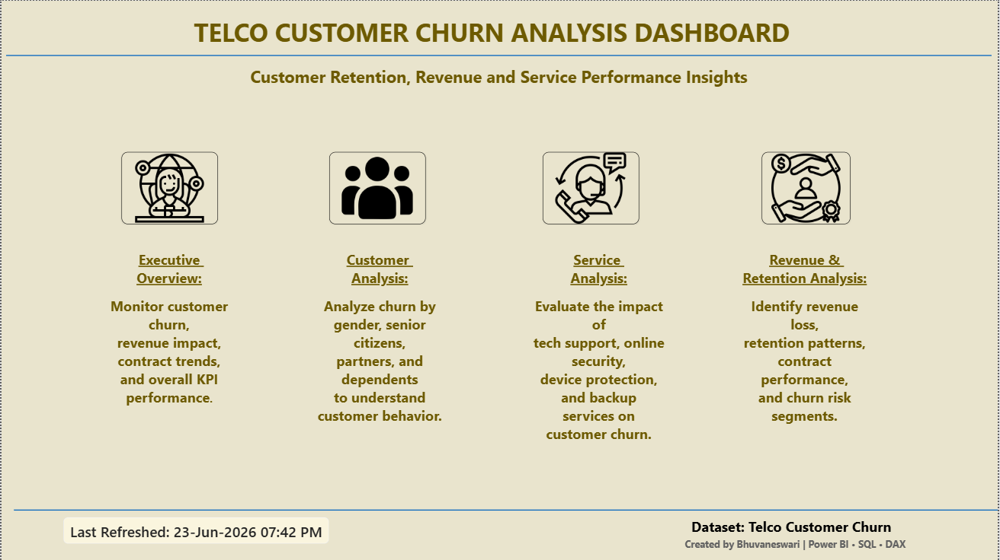
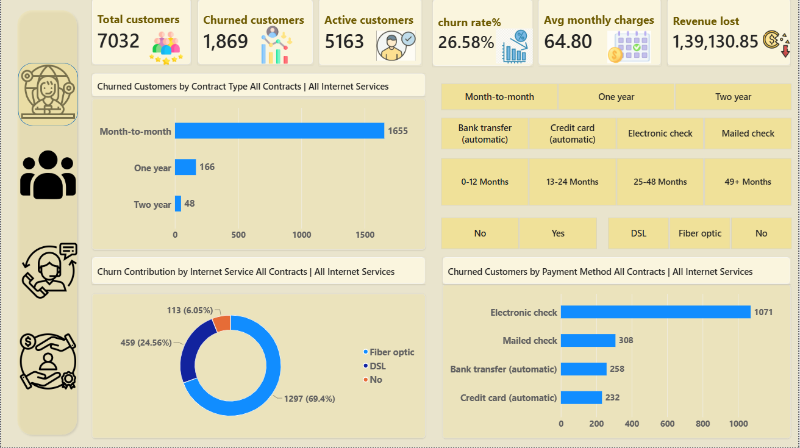
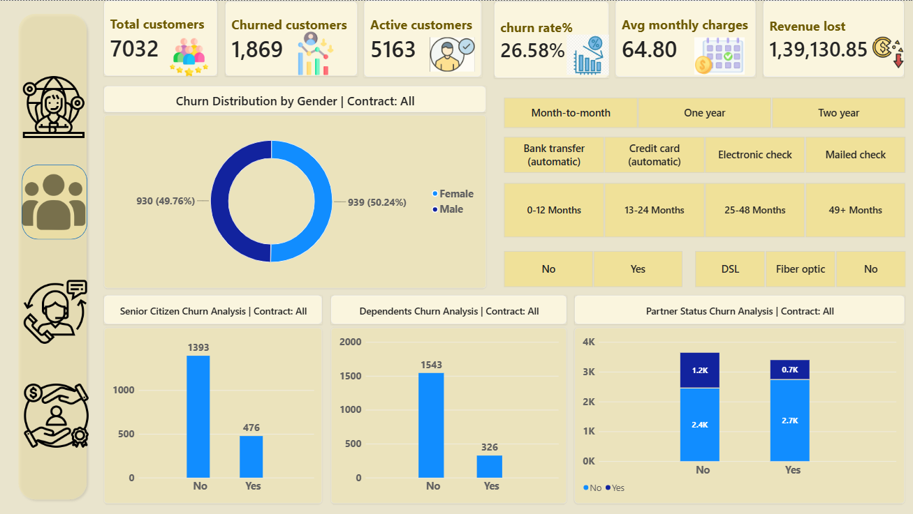
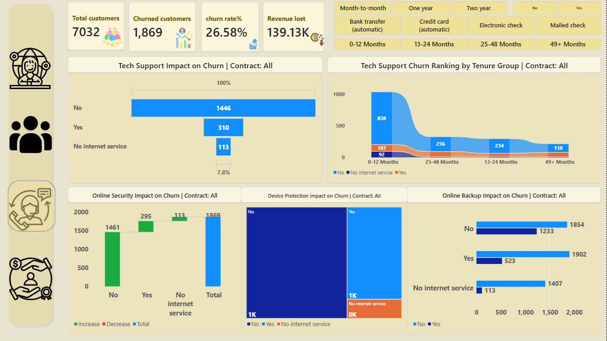

# 📊 Telco Customer Churn Analysis Dashboard (Power BI)

## Project Overview

This project presents an interactive Power BI dashboard developed using the Telco Customer Churn dataset. The dashboard helps analyze customer churn behavior, retention patterns, service adoption, contract performance, and revenue impact.

The objective is to identify key factors influencing customer churn and provide actionable business recommendations to improve customer retention.

---

## Dashboard Features

### Executive Overview
- Customer KPIs
- Churn Rate Analysis
- Revenue Loss Analysis
- Contract Performance Summary

### Customer Analysis
- Churn by Gender
- Senior Citizen Analysis
- Partner Status Analysis
- Dependents Analysis

### Service Analysis
- Tech Support Impact on Churn
- Online Security Analysis
- Device Protection Analysis
- Online Backup Analysis

### Revenue & Retention Analysis
- Revenue Loss by Tenure Group
- Revenue Loss by Payment Method
- Revenue Distribution by Contract Type
- Revenue Retention Analysis

---

## Key KPIs

- Total Customers
- Churned Customers
- Active Customers
- Churn Rate %
- Total Revenue
- Revenue Lost
- Average Monthly Charges

---

## Business Insights

### Customer Behavior
- 26.54% of customers have churned.
- Month-to-Month customers exhibit the highest churn risk.
- Two-Year contract customers show the strongest retention.

### Service Performance
- Customers without Tech Support are more likely to churn.
- Customers without Online Security show higher churn rates.
- Service adoption positively impacts customer retention.

### Revenue Insights
- Electronic Check customers contribute the highest revenue loss.
- Long-tenure customers generate significantly higher revenue.
- Retained customers contribute substantially more lifetime value.

### Customer Segments
- Senior Citizens have relatively higher churn tendencies.
- New customers are more likely to leave compared to long-term customers.

---

## Business Recommendations

1. Encourage customers to switch from Month-to-Month contracts to long-term contracts.
2. Promote Tech Support and Online Security services.
3. Improve customer onboarding during the first year.
4. Reduce churn among Electronic Check customers through targeted retention campaigns.
5. Focus on high-risk customer segments using proactive retention strategies.

---

## Tools Used

- Power BI Desktop
- Power Query
- DAX
- Data Modeling
- Data Visualization

---

## Dashboard Screenshots

### Home Page

### Executive Overview

### Customer Analysis

### Service Analysis

### Revenue & Retention Analysis

---

## Dataset

Telco Customer Churn Dataset

---

## Author

**Bhuvaneswari**

Aspiring Data Analyst | SQL | Power BI | Python | Excel
